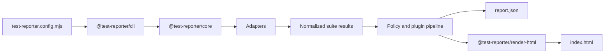

# test-reporter

`test-reporter` is a framework- and language-agnostic test orchestration and reporting toolkit.

It runs suites from multiple test systems, normalizes the results into a single `report.json`, and renders a drillable HTML report with module, theme, package, suite, test, and coverage views.

Built-in adapters currently target common JavaScript tooling, but the execution contract is not tied to a specific language or framework. If a project can produce structured test results or can be wrapped by an adapter, it can be reported through `test-reporter`.

## Purpose

Use `test-reporter` when raw test output is too fragmented to be operationally useful.

Typical cases:

- monorepos with multiple packages and mixed frameworks
- projects that combine unit, browser, e2e, and shell-driven validation
- teams that need one report surface for pass/fail, duration, ownership, and coverage
- projects that want policy-aware grouping such as modules, themes, or product areas

## What It Produces

A run produces:

- `report.json`: normalized machine-readable results
- `index.html`: interactive HTML report
- `raw/`: per-suite raw artifacts and framework output

The HTML report supports:

- module-first and package-first views
- progressive drilldown from summary to individual test detail
- pass/fail, duration, and test-count rollups
- coverage rollups and per-file coverage tables
- optional ownership, classification, and source-analysis enrichment

### Report Overview


### Drilldown View


## Architecture

The system is split into small packages with explicit boundaries.

1. `@test-reporter/cli`
   Runs configured suites and writes JSON + HTML artifacts.
2. `@test-reporter/core`
   Loads config, resolves adapters, executes suites, normalizes results, applies policy, and builds the report model.
3. `@test-reporter/render-html`
   Renders the normalized report into the interactive HTML UI.
4. Built-in adapters
   - `@test-reporter/adapter-node-test`
   - `@test-reporter/adapter-vitest`
   - `@test-reporter/adapter-playwright`
   - `@test-reporter/adapter-shell`
   - `@test-reporter/adapter-jest`
5. Built-in enrichment/plugin package
   - `@test-reporter/plugin-source-analysis`

### Execution Flow



### Package Responsibilities

- `@test-reporter/cli`: command entrypoint and artifact writing
- `@test-reporter/core`: config loading, orchestration, normalization, aggregation, coverage rollups, policy pipeline
- `@test-reporter/render-html`: browser report UI and report rendering
- `@test-reporter/adapter-node-test`: direct `node --test` execution and normalization
- `@test-reporter/adapter-vitest`: Vitest execution, normalization, and coverage collection
- `@test-reporter/adapter-playwright`: Playwright execution and normalization
- `@test-reporter/adapter-shell`: arbitrary command-backed suites
- `@test-reporter/adapter-jest`: Jest execution, normalization, and coverage collection
- `@test-reporter/plugin-source-analysis`: static enrichment of assertions, setup, mocks, and source snippets

## Quickstart

### Local Checkout

This is the fastest way to see the reporter working.

```sh
git clone <repo>
cd test-reporter
yarn install
node ./bin/test-reporter.mjs run --config ./examples/generic-node-library/test-reporter.config.mjs --coverage
```

Artifacts are written to:

```text
examples/generic-node-library/artifacts/test-report/
```

### Minimal Consumer Setup

Create `test-reporter.config.mjs` in the target project:

```js
const rootDir = import.meta.dirname;

export default {
  schemaVersion: '1',
  project: {
    name: 'my-project',
    rootDir,
    outputDir: 'artifacts/test-report',
    rawDir: 'artifacts/test-report/raw',
  },
  execution: {
    continueOnError: true,
    defaultCoverage: false,
  },
  suites: [
    {
      id: 'unit',
      label: 'Unit Tests',
      adapter: 'node-test',
      package: 'app',
      cwd: rootDir,
      command: ['node', '--test', './test/**/*.test.js'],
      coverage: {
        enabled: true,
        mode: 'same-run',
      },
    },
  ],
};
```

Run it with:

```sh
test-reporter run --config ./test-reporter.config.mjs
test-reporter run --config ./test-reporter.config.mjs --coverage
```

### Package Script Integration

#### Yarn

```json
{
  "scripts": {
    "test": "test-reporter run --config ./test-reporter.config.mjs",
    "test:coverage": "test-reporter run --config ./test-reporter.config.mjs --coverage"
  }
}
```

#### npm

```json
{
  "scripts": {
    "test": "test-reporter run --config ./test-reporter.config.mjs",
    "test:coverage": "test-reporter run --config ./test-reporter.config.mjs --coverage"
  }
}
```

#### pnpm

```json
{
  "scripts": {
    "test": "test-reporter run --config ./test-reporter.config.mjs",
    "test:coverage": "test-reporter run --config ./test-reporter.config.mjs --coverage"
  }
}
```

## Integration Model

A host project typically owns only three things:

- `test-reporter.config.mjs`
- a classification / coverage attribution / ownership manifest
- optional host-specific plugins or custom adapters when generic ones are not enough

Everything else should be delegated to `test-reporter`.

### Uniform Runtime Contract

All built-in command-backed adapters follow the same integration rules:

- declare suites explicitly in `test-reporter.config.mjs`
- pass per-suite environment variables with `suite.env`
- consume normalized output from `report.json`
- use `raw/` for framework-native artifacts and intermediate reports

### Empty Workspaces And Zero-Test Suites

If `workspaceDiscovery.packages` lists a package with no matching suites, that package still appears in the report as `skipped` with zero suites. This is the recommended way to keep explicit monorepo packages visible without inventing synthetic suite results.

If a suite runs and the underlying framework reports zero tests, the suite is normalized as `skipped`.

### Playwright In CI

Consumers using the built-in Playwright adapter must install Playwright browsers in CI before running the reporter.

Typical prerequisite:

```sh
yarn playwright install --with-deps
```

### Raw Artifact Contract

Suites can attach raw artifacts that will be written under `raw/` and linked from the HTML report.

Supported shapes:

```js
rawArtifacts: [
  {
    relativePath: 'web-e2e/playwright.json',
    label: 'Playwright JSON',
    content: JSON.stringify(payload, null, 2),
  },
  {
    relativePath: 'web-e2e/trace.zip',
    label: 'Trace ZIP',
    sourcePath: '/absolute/path/to/trace.zip',
    mediaType: 'application/zip',
  },
  {
    relativePath: 'web-e2e/test-results',
    label: 'Copied test-results directory',
    kind: 'directory',
    sourcePath: '/absolute/path/to/test-results',
  },
]
```

Use this contract for stable raw links. Do not treat it as a generic process-management or upload system.

### Consumer Modes

There are two supported consumer modes:

1. Local reference checkout
   - useful while the standalone repo is being developed alongside a host project
   - stable host-facing entrypoints are:
     - `./references/test-reporter/config.mjs`
     - `./references/test-reporter/bin/test-reporter.mjs`
2. Installed package dependency
   - use the published `test-reporter` binary
   - import `defineConfig` from a published package entrypoint such as `@test-reporter/core` when that distribution path is available in your project

For local-reference mode, keep host imports pointed at the root-level entrypoints above rather than `packages/*/src`.

### Classification, Coverage Attribution, And Ownership

If you want the report grouped by product or subsystem instead of leaving tests uncategorized, provide a manifest file.

```json
{
  "rules": [
    {
      "package": "app",
      "include": ["test/**/*.test.js"],
      "module": "runtime",
      "theme": "api"
    }
  ],
  "coverageRules": [
    {
      "package": "app",
      "include": ["src/**/*.js"],
      "module": "runtime",
      "theme": "api"
    }
  ],
  "ownership": {
    "modules": [
      { "module": "runtime", "owner": "runtime-team" }
    ],
    "themes": [
      { "module": "runtime", "theme": "api", "owner": "runtime-api-team" }
    ]
  }
}
```

Reference it from config:

```js
manifests: {
  classification: './test-modules.json',
  coverageAttribution: './test-modules.json',
  ownership: './test-modules.json',
}
```

### Custom Policy Plugins

A plugin can hook into these stages:

- `classifyTest(...)`
- `attributeCoverageFile(...)`
- `lookupOwner(...)`
- `enrichTest(...)`

Register plugins like this:

```js
plugins: [
  {
    handler: './scripts/test-reporter/my-policy-plugin.mjs',
    options: {
      owner: 'platform-team',
    },
  },
]
```

## Examples

- Generic consumer example:
  [`/Users/josh/play/test-reporter/examples/generic-node-library/test-reporter.config.mjs`](/Users/josh/play/test-reporter/examples/generic-node-library/test-reporter.config.mjs)
- Mixed-framework example:
  [`/Users/josh/play/test-reporter/examples/mixed-framework-monorepo/test-reporter.config.mjs`](/Users/josh/play/test-reporter/examples/mixed-framework-monorepo/test-reporter.config.mjs)
- `varcad.io` host integration shape:
  [`/Users/josh/play/test-reporter/examples/varcad/test-reporter.config.mjs`](/Users/josh/play/test-reporter/examples/varcad/test-reporter.config.mjs)
- Integration guide:
  [`/Users/josh/play/test-reporter/docs/integrating-a-generic-project.md`](/Users/josh/play/test-reporter/docs/integrating-a-generic-project.md)

## Development

Run the standalone repo checks with:

```sh
yarn lint
yarn test
yarn build
```

The current external-consumer smoke path is:

```sh
node ./bin/test-reporter.mjs run --config ./examples/generic-node-library/test-reporter.config.mjs --coverage
```

## Versioning

All publishable `@test-reporter/*` packages currently move in lockstep at `0.1.0`.

For deeper release and compatibility details, see:

- [`/Users/josh/play/test-reporter/docs/integrating-a-generic-project.md`](/Users/josh/play/test-reporter/docs/integrating-a-generic-project.md)
- [`/Users/josh/play/test-reporter/docs/migrating-downstream-publishers.md`](/Users/josh/play/test-reporter/docs/migrating-downstream-publishers.md)
- [`/Users/josh/play/test-reporter/docs/versioning-and-release-strategy.md`](/Users/josh/play/test-reporter/docs/versioning-and-release-strategy.md)
# test-reporter
