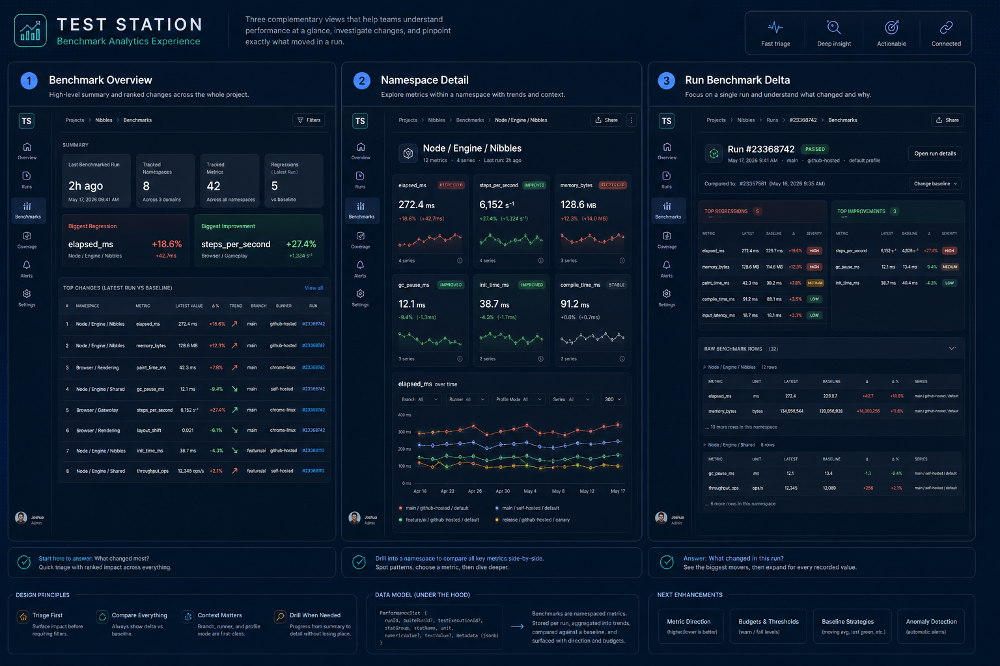

# Test Station Benchmark Explorer Implementation Plan

## Status

- Proposed.
- This document turns the current benchmark storage/query model into a concrete product implementation plan.
- Scope in this document:
  - improve benchmark discoverability and triage on project and run pages
  - preserve the current `PerformanceStat` storage model for the first pass
  - add only the minimum benchmark-specific semantics needed to make regressions readable

## Goals

1. Make it obvious when performance regressed, improved, or stayed stable.
2. Let an operator answer `what changed?` before they need to inspect raw metric history.
3. Keep the first implementation compatible with the current benchmark ingest flow.
4. Reuse the existing GraphQL and Next.js surfaces where they are already structurally sound.
5. Create a benchmark view that scales from summary triage to exact metric inspection.

## Current State

### Storage model

Benchmarks are currently stored as generic performance-stat records in [packages/server/models/PerformanceStat.js](/Users/josh/play/test-station/packages/server/models/PerformanceStat.js).

Each row carries:

- `runId`
- optional `suiteRunId`
- optional `testExecutionId`
- `statGroup`
- `statName`
- `unit`
- `numericValue` or `textValue`
- `metadata`

The current ingest path is:

- report normalization in [packages/core/src/report.js](/Users/josh/play/test-station/packages/core/src/report.js)
- ingest normalization in [packages/server/ingest/normalize.js](/Users/josh/play/test-station/packages/server/ingest/normalize.js)
- persistence in [packages/server/ingest/service.js](/Users/josh/play/test-station/packages/server/ingest/service.js)

### Query model

The benchmark read model is currently split into:

- benchmark catalog discovery via [packages/server/graphql/query-service.js](/Users/josh/play/test-station/packages/server/graphql/query-service.js) `listBenchmarkCatalog(...)`
- metric history via `performanceTrend(...)`
- run-scoped metric rows via `runPerformanceStats(...)`

The web layer currently assembles project benchmark panels in [packages/web/lib/serverGraphql.js](/Users/josh/play/test-station/packages/web/lib/serverGraphql.js).

### UI model

The current benchmark UI lives in:

- [packages/web/components/BenchmarkBits.js](/Users/josh/play/test-station/packages/web/components/BenchmarkBits.js)
- [packages/web/pages/projects/[slug].js](/Users/josh/play/test-station/packages/web/pages/projects/%5Bslug%5D.js)
- [packages/web/pages/runs/[id].js](/Users/josh/play/test-station/packages/web/pages/runs/%5Bid%5D.js)

The current explorer is technically functional but has three important product problems:

1. It is dropdown-first instead of insight-first.
2. It shows historical series but not an explicit regression summary.
3. It makes the operator inspect raw detail before telling them whether anything important changed.

## Design Principles

- Triage first, inspection second.
- Show change before showing raw history.
- Preserve a clear path from project summary to exact run to exact metric row.
- Keep benchmark UI consistent with the broader Test Station web shell and card language.
- Avoid introducing benchmark-only schema complexity until the product shape is proven.

## Proposed Product Shape

The benchmark experience should be split into two layers:

1. `summary/triage`
2. `drill-down inspection`

### Project benchmark landing view

Add a dedicated benchmark view on the project page.

The top section should include a summary header with:

- last benchmarked run
- tracked namespaces
- tracked metrics
- active series
- regressions in latest run
- biggest regression
- biggest improvement

This gives the operator an immediate answer to `is there anything to care about here?`

### Top changes panel

The first benchmark content block should be a ranked `Top Changes` table.

Recommended columns:

- namespace
- metric
- latest value
- previous/baseline value
- delta
- delta percent
- direction chip
- branch
- runner
- linked run

This is the most important addition. The current benchmark UI lacks an explicit change ranking layer.

### Namespace catalog

Replace the current namespace dropdown as the primary entry point.

Use a left rail or card grid of benchmark namespaces, where each namespace card shows:

- namespace name
- latest observed time
- metric count
- series count
- tiny sparkline
- regression count in latest run

This lets the operator discover the benchmark surface without guessing valid namespaces.

### Metric card grid

Once a namespace is selected, show metric cards instead of a metric dropdown.

Each metric card should include:

- metric label
- latest value
- delta vs baseline
- delta percent
- sparkline
- status chip: `regressed`, `improved`, `stable`, or `insufficient baseline`
- series count

This becomes the main browsing surface for the selected namespace.

### Drill-down chart view

Keep the current chart-based explorer as the drill-down experience, not the initial experience.

This drill-down should still support:

- runner filter
- branch filter
- profile mode filter
- timeframe filter
- series toggles

The current [BenchmarkExplorer](/Users/josh/play/test-station/packages/web/components/BenchmarkBits.js) is a good foundation for this.

### Run-level benchmark delta view

The run detail page should pivot from raw grouped stats to `what changed in this run`.

The top benchmark section on a run page should show:

- top regressions in this run
- top improvements in this run
- new metrics/series first seen in this run
- missing baseline cases

The raw grouped performance rows should remain available, but as a secondary section.

## Information Architecture

### Project page

Recommended structure:

1. Benchmark summary header
2. Top changes table
3. Namespace catalog
4. Metric card grid for selected namespace
5. Detailed chart inspector

### Run page

Recommended structure:

1. Run benchmark delta summary
2. Top regressions
3. Top improvements
4. Benchmark namespace groups with raw stat rows

## Benchmark Semantics To Add

The current storage shape is flexible, but the UI lacks benchmark-specific meaning.

### Direction of goodness

The system needs to know whether a metric getting larger is good or bad.

Examples:

- `elapsed_ms`: lower is better
- `steps_per_second`: higher is better
- `memory_bytes`: lower is better

Without this, the UI cannot confidently label a change as a regression.

### Budget and threshold metadata

Add optional threshold metadata so the UI can differentiate:

- stable
- warning
- regression
- severe regression

This can initially live in metric metadata or a simple config layer before becoming a first-class table.

### Baseline strategy

Define one baseline rule and use it consistently.

Recommended first rule:

- compare latest metric point to the immediately previous point for the same:
  - `projectKey`
  - `statGroup`
  - `statName`
  - `seriesId`
  - `runnerKey`
  - `branch`

Later, this can expand to:

- branch baseline
- release baseline
- pinned baseline run

## Query and Data Recommendations

### Phase 1: stay on the current model

For the first implementation pass, keep:

- `benchmarkCatalog(...)`
- `performanceTrend(...)`
- `runPerformanceStats(...)`

This avoids a schema migration before the UX is validated.

### Phase 2: add a benchmark summary query

Add a project-scoped benchmark summary query that returns:

- namespace-level snapshots
- metric-level latest values
- previous values
- delta and delta percent
- status classification
- latest run references

Recommended shape:

- `benchmarkSummary(projectKey: String!, limit: Int): BenchmarkSummary!`

Recommended nested fields:

- `namespaces`
- `topRegressions`
- `topImprovements`
- `latestRun`

### Phase 3: precompute benchmark summary state

Once the UX is settled, move benchmark deltas out of request-time composition.

Options:

- precompute on ingest
- materialize on demand and cache
- create a dedicated summary table

The current `listBenchmarkCatalog(...)` implementation loads all scoped runs and all matching stats into memory. That is acceptable for the current footprint, but it is not the right long-term foundation for ranked regression views.

## Recommended Implementation Phases

### Phase 0: finalize benchmark semantics

Objective:

- lock meaning before changing UI behavior

Checklist:

- define direction rules for core metrics
- define baseline strategy
- define regression thresholds
- define how branch and runner affect comparison grouping

Exit criteria:

- one documented classification rule for `regressed`, `improved`, and `stable`

### Phase 1: project benchmark dashboard using current queries

Objective:

- add a better benchmark UI without changing storage

Checklist:

- add a benchmark summary header on the project page
- add a top changes table
- replace namespace dropdown as the primary surface with a namespace catalog
- replace metric dropdown as the primary surface with metric cards
- keep the existing chart explorer as the drill-down view

Likely files:

- [packages/web/pages/projects/[slug].js](/Users/josh/play/test-station/packages/web/pages/projects/%5Bslug%5D.js)
- [packages/web/components/BenchmarkBits.js](/Users/josh/play/test-station/packages/web/components/BenchmarkBits.js)
- [packages/web/pages/_app.js](/Users/josh/play/test-station/packages/web/pages/_app.js)

Exit criteria:

- operator can identify the biggest regression without opening the detailed chart inspector

### Phase 2: run benchmark delta view

Objective:

- make run pages answer `what changed in this run?`

Checklist:

- add run benchmark summary cards
- add top regressions and top improvements sections
- move raw grouped benchmark rows lower in the page
- link each metric row to the drill-down explorer

Likely files:

- [packages/web/pages/runs/[id].js](/Users/josh/play/test-station/packages/web/pages/runs/%5Bid%5D.js)
- [packages/web/components/BenchmarkBits.js](/Users/josh/play/test-station/packages/web/components/BenchmarkBits.js)

Exit criteria:

- operator can identify benchmark regressions from a run page without reading raw stat rows

### Phase 3: benchmark summary GraphQL surface

Objective:

- stop rebuilding regression summaries in the web layer

Checklist:

- add `benchmarkSummary(...)` query
- add namespace snapshot fields
- add metric delta and classification fields
- update the project page to consume this summary instead of composing every view client-side

Likely files:

- [packages/server/graphql/queries.js](/Users/josh/play/test-station/packages/server/graphql/queries.js)
- [packages/server/graphql/query-service.js](/Users/josh/play/test-station/packages/server/graphql/query-service.js)
- [packages/web/lib/queries.js](/Users/josh/play/test-station/packages/web/lib/queries.js)
- [packages/web/lib/serverGraphql.js](/Users/josh/play/test-station/packages/web/lib/serverGraphql.js)

Exit criteria:

- project benchmark summary can render with one summary query plus targeted trend requests

### Phase 4: benchmark semantics and budgets

Objective:

- classify changes with confidence

Checklist:

- add metric direction config
- add threshold or budget config
- classify summary rows and metric cards
- surface `warning` and `severe regression` states in the UI

Exit criteria:

- the UI can mark a metric as a regression based on explicit semantics, not heuristic guessing

## Non-Goals For The First Pass

- fully redesigning benchmark ingestion
- replacing the current `PerformanceStat` model
- introducing benchmark-only time-series storage
- statistical significance analysis
- flaky benchmark detection
- per-user customizable dashboards

## Success Criteria

The redesign is successful when:

1. A project page tells the operator whether performance changed without requiring filter setup.
2. A run page clearly shows the most important regressions and improvements.
3. The existing detailed chart explorer remains available for precise inspection.
4. The server API surface remains compatible with the current benchmark ingest contract during the first pass.
5. Follow-up work can add benchmark semantics without rewriting the entire web surface.

## Recommended Next Step

Build Phase 1 first.

The highest-value first deliverable is not a new chart. It is:

- benchmark summary header
- top changes table
- namespace cards
- metric cards with delta and sparkline

That gives the product an intuitive benchmark entry point while preserving the current storage and query system.
