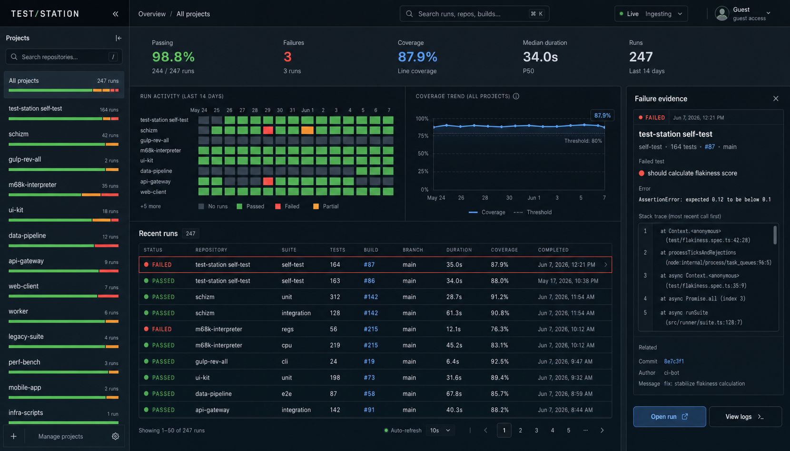

# Test Station Operations Overview Redesign

## Status

- Implemented and deployed; public/guest acceptance is complete. Authenticated/admin runtime acceptance remains pending because the available browser sessions are signed out.
- Reference image: `docs/assets/operations-overview-observability-console-concept.png`.
- Primary route: `/`.
- The work should be delivered in visually reviewed slices. Every slice ends with a real render, a comparison against the reference, and an interaction/test pass before the next slice starts.
- Phases 0–7 are accepted on the deployed revision. Phase 8 is accepted for release, performance, public data, responsive behavior, and failure evidence; only its authenticated/admin viewer check remains pending.

### Current implementation checkpoint

The current worktree completes the planned condensed-view implementation:

- compact overview-only application shell;
- dense recent-publication grid with project, status, build, branch, duration, coverage, and relative completion time;
- URL-backed `inspectRun` selection and a responsive metadata inspector;
- URL-backed 14-day activity heatmap and adaptive scoped coverage trend with an honest loaded-window disclosure;
- explicit `Benchmark` and `Coverage` publication presentation based on active submission kinds instead of treating every publication as a test run;
- project search, collapsible/off-canvas scope, distribution bars, composed URL-backed search/status/day/page state, and 50-row client pages;
- lazy authorized failure evidence with caching, direct selected-run URLs, unavailable/error/retry states, and report/source actions;
- pauseable 60-second refresh with last-good stale/error handling;
- preserved project visibility filtering, cursor feed loading, performance hooks, direct run navigation, and Redux navigation context;
- focused query/model/browser tests, the full `196/196` repository suite, syntax lint, a real Next.js production build, and retained review artifacts at all required viewports.

Production runs revision `ff87936f068e18cd9d7b436c427aec9b43c5a8ad` from image digest `sha256:28c6cc335a9a0df8ae2b1c88c746574b1797f15ef8ebc856856d845669dd9015`. Release, runtime, and machine-readable evidence are retained below and under `artifacts/ui-review/operations-overview/phase-8`. The only open acceptance item is a signed-in browser session for authenticated/admin review.

## Product Intent

The concept changes Test Station from a spacious report landing page into a compact operations console.

In UI/UX terms, it uses:

- **Triage-first information architecture:** health, failures, coverage drift, and duration are visible before explanatory copy.
- **A cockpit layout:** persistent project scope on the left, aggregate signals and the run feed in the center, contextual evidence on the right.
- **Master-detail interaction:** selecting a run keeps the operator in context and opens evidence beside the feed; explicit actions navigate to the full run or logs.
- **Progressive disclosure:** summary numbers and status marks are always visible, while stack traces and related metadata appear only for the selected run.
- **High-density scanning:** small type, fixed columns, short rows, aligned numerals, and hairline separators replace large cards and generous vertical gaps.
- **Color as operational meaning:** green, red, orange, and blue communicate state; they are not used as decoration.
- **Coordinated filtering:** project selection, search, activity cells, charts, and run rows describe the same active scope.

The target feeling is calm, technical, and immediate: an operator should understand current health in a few seconds and reach raw evidence with one selection.

## Condensed View Contract

The overview is one route with three coordinated presentations, not three independent pages. Project scope and loaded feed state are shared; view and selected-run state are URL-addressable.

### 1. Runs view — default command center

Purpose: scan the newest publications and identify the next item to inspect.

- URL: `/`, optionally with project/filter query state.
- Dominant surface: compact fixed-column run grid.
- Always visible: project scope, loaded-window summary, status/publication kind, build, branch, duration, coverage, completion time, pagination state.
- Primary interaction: select a row in place; direct links within the row remain independently actionable.
- Density target: at least `9` useful rows in a `900px`-high desktop viewport with the shell and toolbar visible.
- Narrow-screen behavior: keep project/result, status, build, and completion visible; progressively hide lower-priority columns without body-level horizontal overflow.

### 2. Activity view — cross-project signal matrix

Purpose: compare project health and publication cadence without reading every row.

- URL: `/?view=activity`, composable with project and inspector state.
- Initial implementation: newest six loaded publications per project.
- Target implementation: project-by-day cells over a common 14-day window, with worst-state precedence and accessible counts.
- Cell selection: selects or filters the corresponding run/project/time bucket while retaining the operator's overview context.
- Each cell must distinguish passed, failed, benchmark, coverage, skipped, and unknown through text/symbol plus color.
- The UI must state whether it represents the loaded feed window or the complete requested time window; it must never imply completeness when pagination has not loaded it.

### 3. Inspector view — contextual run detail

Purpose: answer the first diagnostic questions without forcing route navigation.

- URL state: `?inspectRun=<id>`; it may coexist with `view=activity` and later filter parameters.
- Baseline content: project, publication kind/status, test summary, build, branch, commit, duration, coverage, completion time, full-run action, and source-run action.
- Target content: lazy, permission-checked failure evidence and the best available report/log action.
- Desktop: persistent right column when space permits.
- Medium: non-modal overlay that preserves the table and selection.
- Narrow: bottom sheet with bounded height, independent internal scrolling, close action, and restored row focus.
- Escape, close, browser back/forward, refresh, and direct URL entry must preserve predictable scope and selection behavior.

### Shared state ownership

| State | Canonical owner | URL representation | Persistence rule |
| --- | --- | --- | --- |
| Visible projects | server authorization result | none | recomputed per request/viewer |
| Selected project | overview store/model | planned `project=<slug>` | preserved across view switches |
| View mode | router | absent for Runs, `view=activity` for Activity | shareable and back/forward safe |
| Selected run | router plus Redux navigation context | `inspectRun=<id>` | preserved until close or scope invalidation |
| Search/status/date filters | router and pure overview model | planned explicit query keys | composable and removable |
| Loaded feed/cursors | page component | none | retained during shallow view/selection changes |
| Failure evidence cache | client request cache keyed by run id | none | reused within the page session |

No condensed view may introduce a second authorization path or independently reinterpret publication status. `publicationKinds` and the visible-project boundary remain server-owned facts.

## Visual Contract

The reference is directional rather than a pixel-perfect specification, but the following characteristics are mandatory.

### Geometry

- Full-viewport application frame with no large outer page margin.
- Compact top bar: approximately `56px` high.
- Desktop project rail: approximately `272px` wide.
- Desktop evidence inspector: approximately `340px` wide when open.
- Summary band: one horizontal row, approximately `124px` high.
- Analysis band: activity heatmap and coverage trend share one row.
- Run rows: target `36–40px` for the primary row, with no card container per row.
- Corner radii stay between `0–8px`; panels are defined primarily by borders and background changes.

### Visual tokens

Initial values should be tuned through screenshot comparison, not treated as immutable:

| Role | Starting value |
| --- | --- |
| App background | `#07111a` |
| Raised surface | `#0b1823` |
| Strong surface | `#0e1d29` |
| Hairline border | `rgba(142, 164, 184, 0.18)` |
| Primary text | `#dce7ef` |
| Muted text | `#8798a8` |
| Accent/link | `#59aaf8` |
| Success | `#55cc70` |
| Failure | `#ff5b57` |
| Partial/warning | `#f7a844` |

- Remove the current decorative gradients, glass blur, large shadows, `28px` radii, and pill-heavy presentation from this route.
- Use the existing system sans-serif stack for readable UI text and add a local monospace stack for numerals, builds, commits, durations, code, and chart axes.
- Default scale: `12px` labels, `13–14px` body, `16px` section titles, and `28–32px` summary values.
- Use tabular numerals so columns and changing metrics remain stable.

### Hierarchy and density rules

- Every section begins with a short label, not a sentence of explanation.
- Borders and alignment provide grouping before background color or shadow.
- Status labels include text or an icon; color alone is never the only signal.
- Reserve red for active failure and regression evidence.
- Keep the run table as the dominant working surface.
- Empty, loading, stale, and error states must occupy the same geometry as populated states to avoid layout jumps.

## Interaction Contract

### Project rail

- `All projects` is the default scope.
- Project search filters the visible rail immediately by project/repository name.
- Selecting a project updates the summary band, heatmap, coverage trend, and run feed without navigating away.
- Each project row shows run count plus a status distribution bar for the active 14-day window.
- The rail can collapse on desktop and becomes an off-canvas chooser below the desktop breakpoint.

### Search and scope

- The top command field searches the currently available run feed across repository, suite, build, branch, commit, and external key.
- Search is keyboard reachable and exposes its shortcut in the UI.
- Search, project scope, status filter, and activity-cell filter combine predictably and expose removable filter state.
- No control should be present as a decorative placeholder.

### Activity heatmap

- The default window is the last 14 calendar days in the viewer's locale.
- Each project/day cell uses the worst run state for that bucket: `failed` over `partial` over `passed`; no runs is neutral.
- A tooltip or accessible description reports date, run count, and status counts.
- Selecting a cell filters the feed to that project and day; selecting it again clears that filter.

### Coverage trend

- In a project scope, the line is that project's recorded line coverage.
- In `All projects`, each daily point is the unweighted mean of the latest available line-coverage value for each visible project on that day. The tooltip states how many projects contributed.
- Missing coverage is excluded, not treated as zero.
- The threshold line is labeled and must come from configuration; do not hard-code `80%` if the product has no configured threshold.

### Run feed and evidence inspector

- A single click or keyboard activation selects a run and opens the evidence inspector; it does not immediately leave the overview.
- The selected row receives a strong outline and `aria-selected="true"`.
- `Open run` navigates to the existing `/runs/[id]` route.
- `View logs` opens the best available log/report artifact; hide or disable it with a reason when no log target exists.
- Closing the inspector preserves the current scope and scroll position.
- Represent the selected run in the URL, for example `/?inspectRun=<id>`, so refresh, back/forward, and sharing retain the inspection state.
- Auto-refresh must not replace the selected row or close the inspector. If the selected run falls outside the active filter, explain that state and offer to clear filters.

### Live and refresh state

- `Live` means the last refresh succeeded and the data is within the freshness window.
- Use interval refresh first; this plan does not require WebSockets.
- Show the interval and allow pause/resume.
- On refresh failure, keep the last good data, mark it stale, and provide retry feedback.

## Data Semantics

Use one shared 14-day window for the first release.

- `Passing`: passed runs divided by terminal runs with a known passed/failed status.
- `Failures`: number of failed runs.
- `Coverage`: latest scoped coverage value using the coverage rule above.
- `Median duration`: median `durationMs` of completed runs with a finite duration.
- `Runs`: all visible runs completed inside the active window.
- Project distribution bars: proportions of passed, partial/warning, and failed runs within the active window.

Do not copy illustrative values from the concept into production. Every number, chart point, failure message, stack frame, commit, and actor must come from the current data contract or display an honest unavailable state.

## Current Repository Seams

The current overview is implemented in [packages/web/pages/index.js](../packages/web/pages/index.js). It already has project selection, an SSR run feed, incremental row loading, keyboard row navigation, and stable performance hooks.

The important seams are:

- [packages/web/components/WebShell.js](../packages/web/components/WebShell.js): the current global hero, navigation, and identity block. It must become the compact top application bar without breaking project, run, auth, or admin pages.
- [packages/web/pages/_app.js](../packages/web/pages/_app.js): shared theme and the large `GlobalStyle` definition. Overview-specific rules must be scoped so the redesign does not accidentally restyle every route.
- [packages/web/lib/homeExplorer.js](../packages/web/lib/homeExplorer.js): the existing pure overview model. Extend or replace it with deterministic selectors for windowing, metrics, project health, heatmap buckets, coverage points, search, and pagination.
- [packages/web/lib/queries.js](../packages/web/lib/queries.js) and [packages/web/lib/serverGraphql.js](../packages/web/lib/serverGraphql.js): the current `WEB_HOME_QUERY` and SSR normalization path.
- [packages/server/graphql/query-service.js](../packages/server/graphql/query-service.js) and [packages/server/graphql/queries.js](../packages/server/graphql/queries.js): visible-project authorization, run feed data, and any new narrow failure-evidence query.
- [packages/web/pages/runs/[id].js](../packages/web/pages/runs/%5Bid%5D.js): existing failure rendering and full-run navigation destination.
- [packages/web/components/CoverageTrendPanel.js](../packages/web/components/CoverageTrendPanel.js): useful chart math, but its card presentation should be generalized or replaced for the denser overview.
- [tests/phase13-web-phase5.test.js](../tests/phase13-web-phase5.test.js): current web query/model coverage.
- [tests/e2e/live-navigation-interaction.spec.js](../tests/e2e/live-navigation-interaction.spec.js): current home-row and route interaction contract.
- [tests/e2e/live-navigation-performance.spec.js](../tests/e2e/live-navigation-performance.spec.js): existing performance budgets and `data-perf-id` hooks that must be preserved or intentionally migrated.

Important constraint: the worktree already contains unrelated release/package changes. Implementation must keep those out of this redesign's commits.

## Proposed Component Shape

Keep [packages/web/pages/index.js](../packages/web/pages/index.js) as the route and SSR orchestration layer, then move presentation into focused components:

- `packages/web/components/OperationsOverview.js` — grid orchestration and shared filter/selection state.
- `packages/web/components/OperationsProjectRail.js` — project search, scope selection, and distribution bars.
- `packages/web/components/OperationsSummaryStrip.js` — five aggregate metrics.
- `packages/web/components/RunActivityHeatmap.js` — accessible project/day matrix.
- `packages/web/components/OperationsCoverageChart.js` — scoped coverage line and threshold.
- `packages/web/components/OperationsRunGrid.js` — dense selectable run feed and pagination.
- `packages/web/components/FailureEvidencePanel.js` — lazy evidence, loading/error/empty states, and actions.
- `packages/web/lib/operationsOverview.js` — pure derivation and filter functions.

Retain `React.createElement` and styled-components conventions for the first delivery. Scope new CSS under `.operations-overview` and `.operations-shell`. Do not combine this work with a JSX conversion or a full style-system migration.

The current candidate intentionally proves the interaction model inside `pages/index.js`. Component extraction is the next structural step, before adding search, calendar aggregation, charts, or asynchronous evidence. This prevents the route from becoming the permanent owner of presentation, URL-state coordination, feed loading, and inspector behavior.

## Data Work

### Reuse immediately

The existing `runFeed` already supplies enough data for the first real versions of:

- summary counts and pass rate
- median duration
- project status distribution
- 14-day activity buckets
- build, branch, status, completion time, and coverage columns
- a basic all-project coverage series

Derive these values in pure functions so the first visual slices can use real data without waiting for a new aggregate API.

### Add narrow failure evidence

The existing `RUN_DETAIL_QUERY` fetches much more than the inspector needs, and the home payload has no stack/error occurrence data. Add a narrow authorized query, such as `runFailureEvidence(runId: ID!)`, returning:

- run identity and source/log links
- the first or selected failed test
- failure messages
- associated error occurrence message and stack
- commit, branch, build, trigger actor, and completion time

Back it with `TestExecution` and `ErrorOccurrence` through the existing visible-run authorization path. Load it only after a row is selected and cache it by run id.

### Revisit feed pagination after the real render

For the first parity slice, paginate the already loaded SSR feed client-side to match the concept while preserving current behavior and hooks. Measure the serialized page payload and server timing with production-like data.

If the home payload exceeds `300 KB` compressed-equivalent JSON or the existing home query budget regresses by more than `15%`, add a cursor-based run-feed connection with filters and a separate aggregate overview query. Do not silently truncate the feed because the summary and project counts must remain truthful.

## The Iterative Implementation Loop

Use this loop for every phase below:

1. **Select one vertical slice.** Change one region or behavior, not the entire page at once.
2. **Implement with real data.** Avoid fixture-only UI and decorative inactive controls.
3. **Render at the reference viewport.** Primary comparison size is `1660 × 948`.
4. **Compare in order:** geometry, density, typography, color, then micro-interactions. Fixing color before layout usually wastes a review cycle.
5. **Capture an artifact.** Save the screenshot under `artifacts/ui-review/operations-overview/<phase>/` with a short gap log.
6. **Exercise the slice.** Mouse, keyboard, loading, empty, failed-request, and stale-data states.
7. **Run focused checks.** Model/query tests, syntax lint, and relevant Playwright interaction/performance checks.
8. **Review the diff.** Confirm unrelated worktree changes are untouched and the slice remains independently reversible.
9. **Repeat until the exit criteria pass.** Only then begin the next phase.

The visual comparison is structural rather than a raw full-page pixel threshold because production data and timestamps vary. Use overlays or side-by-side screenshots to judge alignment and density, and use deterministic tests for behavior.

## Phased Plan

### Delivery status summary

Status meanings:

- `complete-local`: implemented and validated in the current worktree, but not necessarily committed or deployed;
- `partial`: a truthful baseline exists, but the phase's full acceptance contract is not met;
- `planned`: no acceptance evidence exists yet;
- `accepted`: reserved for an exact committed and deployed revision with retained evidence.

| Phase | Current status | Next decisive deliverable |
| --- | --- | --- |
| 0. Baseline and review harness | accepted | Baseline/final screenshots and machine-readable timings retained with the deployed revision |
| 1. Compact application shell | accepted | Compact shell verified on the deployed overview and `/auth/signin` |
| 2. Project rail and shared model | accepted | Public authorized project scope verified against production data |
| 3. Summary strip | accepted | Production metrics and unavailable coverage state verified |
| 4. Activity and coverage band | accepted | Production 14-day buckets and unavailable coverage series verified |
| 5. Dense run grid and selection | accepted | Deployed URL/filter/pagination behavior and project/run navigation verified |
| 6. Failure evidence inspector | accepted | Deployed failed run `e4aed381-1127-4c77-a5d9-585aa6ac1c61` verified end to end |
| 7. Refresh, resilience, responsive, accessibility | accepted | Live state, keyboard flows, 390px/desktop layout, and zero-overflow captures verified |
| 8. Performance and rollout | partial | Release and public performance accepted; authenticated/admin browser acceptance awaits a signed-in session |

Each phase advances only when its exit criteria and evidence are complete. Local visual success does not change a phase to `accepted`.

### Phase 0 — Baseline and review harness

1. Preserve the concept image as the visual reference.
2. Capture the current `/` route at `1660 × 948`, `1440 × 1024`, and `1024 × 768`.
3. Record current home SSR/server-timing, serialized data size, row-navigation timing, and console errors.
4. Create the phase screenshot/gap-log folder convention.
5. Write a compact visual checklist from the Visual Contract above.

Exit criteria:

- Current visual and performance baselines are saved.
- The reference and review viewports can be reproduced consistently.

### Phase 1 — Compact application shell

1. Refactor `WebShell` from the hero card into a `56px` top bar with brand, breadcrumb/navigation, search slot, live state, and compact identity menu.
2. Keep project, run, auth, and admin routes functional within the new shell.
3. Introduce the flat dark tokens and monospace numeric style.
4. Scope route-specific console styles; do not globally flatten all existing cards yet.

Visual loop focus: viewport use, header height, flat surfaces, border contrast, and removal of decorative gradients.

Exit criteria:

- The home page begins at the top of the viewport with no hero copy.
- Existing route navigation and sign-in/sign-out remain reachable by keyboard.
- Non-home routes show no blocking layout regressions.

### Phase 2 — Project rail and shared overview model

1. Extract pure overview calculations into `operationsOverview.js`.
2. Implement project scope, project search, run counts, and status distribution bars.
3. Add collapse/off-canvas behavior and preserve selected project semantics from the Redux store.
4. Keep `data-perf-id="sidebar-all-runs"` or migrate all dependent tests in the same slice.

Visual loop focus: rail width, row density, status-bar proportions, active state, and long repository-name truncation.

Exit criteria:

- Scope changes update all derived regions from one model.
- Search, keyboard selection, empty projects, and long names work.
- No project is shown outside the viewer's authorized project list.

### Phase 3 — Summary strip

1. Add passing rate, failure count, scoped coverage, median duration, and run count.
2. Apply the documented time-window and missing-data semantics.
3. Add honest unavailable and zero-run states.
4. Use tabular numerals and stable column widths to prevent refresh jitter.

Visual loop focus: horizontal alignment, value scale, whitespace, and semantic color restraint.

Exit criteria:

- Unit tests cover mixed status, missing duration, missing coverage, zero runs, and project scope.
- Every displayed metric can be traced to the loaded run data.

### Phase 4 — Activity and coverage analysis band

1. Implement the accessible 14-day heatmap and legend.
2. Add activity-cell filtering and a visible clear-filter affordance.
3. Implement the scoped coverage line, point tooltips, contribution counts, and optional configured threshold.
4. Reuse chart math where sound, but do not carry forward the large rounded card treatment.

Visual loop focus: shared panel heights, chart density, cell rhythm, axis legibility, and color contrast.

Exit criteria:

- Heatmap buckets and coverage points pass deterministic date/time-zone tests.
- Charts have useful accessible names/summaries and do not rely on hover alone.
- The analysis band remains readable at `1024px` without horizontal page overflow.

### Phase 5 — Dense run grid and selection model

1. Replace the current large rows with the concept's compact fixed-column grid.
2. Include status, repository, suite/summary, tests, build, branch, duration, coverage, and completion time.
3. Preserve direct links inside rows without triggering row selection.
4. Add client-side pages of 50 over the loaded SSR feed, search/filter integration, selection, keyboard movement, and URL-backed inspector state.
5. Preserve or intentionally update the existing row performance hooks.

Visual loop focus: `36–40px` row rhythm, column alignment, truncation, selected/focus states, and scan speed.

Exit criteria:

- Mouse and keyboard selection work without accidental navigation.
- `Open run` retains the existing `/runs/[id]` path.
- Pagination, refresh, filters, and row selection compose without losing state.

### Phase 6 — Real failure evidence inspector

1. Add the narrow GraphQL schema, query-service method, web query, and lazy client loader.
2. Render run metadata, failed test, error message, stack, related commit/actor information, and source/log actions.
3. Add loading skeleton, no-failure, unauthorized/not-found, missing-stack, and network-error states.
4. Sanitize and constrain long stack/error content; never inject it as HTML.
5. Make the panel persistent on wide desktop, an overlay at medium widths, and a full-height sheet on narrow screens.

Visual loop focus: inspector width, evidence hierarchy, code readability, action placement, and selected-row continuity.

Exit criteria:

- Failure evidence is real, access-controlled, lazy-loaded, and cached.
- Closing, back/forward, refresh, and direct `inspectRun` URLs behave predictably.
- Logs/report actions accurately reflect available artifacts.

### Phase 7 — Live refresh, resilience, responsive behavior, and accessibility

1. Add pauseable interval refresh with explicit live/stale/error states.
2. Preserve scope, page, scroll, and selection across refreshes.
3. Finish breakpoint behavior for rail, charts, table overflow, and inspector.
4. Audit landmarks, heading order, table semantics, `aria-selected`, focus order, shortcuts, tooltips, and contrast.
5. Respect reduced motion and avoid animated layout shifts.

Review viewports:

- `1660 × 948`: reference composition with persistent rail and inspector.
- `1440 × 1024`: same three-column model with slightly tighter center content.
- `1024 × 768`: collapsed rail and overlay inspector.
- `390 × 844`: stacked summary, horizontally contained run grid, off-canvas rail, and evidence sheet.

Exit criteria:

- No essential information or action depends on hover.
- There is no body-level horizontal overflow.
- Keyboard-only triage from project selection to run evidence to full run succeeds.

### Phase 8 — Performance, final visual convergence, and rollout

1. Run focused node tests, web lint/build, existing interaction checks, and existing performance checks.
2. Compare final screenshots against the concept and the Phase 0 baseline.
3. Fix remaining gaps in this order: geometry, density, typography, color, then polish.
4. Validate the real route with public/guest and authenticated/admin viewers.
5. Decide from measured payload/timing whether cursor pagination is required before release.
6. Roll out without unrelated release/package diffs, then verify the deployed `/` route and one selected failure end to end.

Final acceptance criteria:

- The first viewport clearly reads as the reference observability console rather than the previous card/hero design.
- Project health, aggregate signals, coverage drift, run history, and failure evidence are simultaneously useful at desktop width.
- All visible data is truthful and permission-scoped.
- Existing project/run navigation remains intact.
- Focused performance metrics do not regress more than `15%` without an understood, documented reason.
- The final deployed screenshot, interaction proof, and test results are saved with the implementation record.

## Testing Matrix

| Layer | Coverage |
| --- | --- |
| Pure model tests | time windows, pass rate, median, health bars, heatmap precedence, coverage aggregation, filtering, pagination |
| GraphQL/query-service tests | visible-project scoping, narrow failure evidence, missing evidence, authorization |
| SSR mapping tests | home payload normalization and unavailable values |
| Component/DOM tests | labels, statuses, loading/empty/error states, inspector semantics |
| Playwright interactions | scope, search, heatmap filter, row selection, URL state, open run, close inspector, refresh persistence |
| Playwright performance | home ready, first row ready, row-to-run navigation, evidence request timing |
| Manual visual review | reference viewport, responsive viewports, long values, empty data, active failure, stale data |

## Deployment Acceptance Evidence

- Application revision: `ff87936f068e18cd9d7b436c427aec9b43c5a8ad`.
- Image: `ghcr.io/smysnk/test-station:sha-ff87936f068e18cd9d7b436c427aec9b43c5a8ad` at `sha256:28c6cc335a9a0df8ae2b1c88c746574b1797f15ef8ebc856856d845669dd9015`.
- Release workflow: [Main Release Pipeline 32887549696](https://github.com/smysnk/test-station/actions/runs/32887549696), successful including validation, image publication, Fleet rollout, deployed benchmarks, mixed-load reliability, and checkpoint publication. The dispatch used `publish_npm=false` and `deploy_fleet=true`.
- Runtime health: `/api/healthz` and `/api/readyz` returned `200`; web and read-server revisions matched the target, and expected/applied migration `20260824_bounded_read_indexes` matched.
- Production data: 7 public projects, 50 initially loaded publications, and 12 publications in the viewer-local 14-day window. The deployed summary showed 12/12 passed, 0 failed, 2.1 s median duration, and an honest unavailable coverage state.
- Production integration fix: GraphQL timestamps arrive as millisecond strings. Revision `8cc4fcb` centralized numeric-string/ISO timestamp parsing after the first deployment revealed an empty 14-day view; a regression test now covers that wire representation.
- Failure evidence: direct selection of failed run `e4aed381-1127-4c77-a5d9-585aa6ac1c61` returned `200` and rendered the failed test, location, message, missing-stack state, metadata, and unavailable report/log reason outside the loaded feed.
- Browser behavior: the deployed 1660px and 390px views had no body-level horizontal overflow; activity exposed 14 labeled days; the narrow inspector rendered as a fixed bottom sheet; and the review browser reported no console warnings or errors.
- Interaction suite: 6 live navigation/overview checks passed and 2 benchmark-dashboard checks skipped because no matching public benchmark dashboard data was present.
- Deployed p95 browser gates over five measured samples: home ready `651.6 ms` (`1,000 ms` budget), project focus `352.3 ms`, project clear `327.4 ms`, project page ready `404.1 ms`, run navigation `355.0 ms`, runner report ready `1,094.7 ms`, operations view switch `1,047.4 ms`, suite expansion `85.8 ms`, paginated test fetch `98.6 ms`, and project navigation `138.6 ms`.
- Deployed home p95 supporting metrics: TTFB `477.4 ms`, FCP/LCP `588 ms`, CLS `0`, decoded HTML `72,782 B`, 326 DOM nodes, and 12 visible rows.
- Reliability: the 25-reader/75-request mixed-load gate passed with zero failures and zero `5xx` responses; p95 was `4,059.58 ms` while a large ingest completed with `200` in `4,077.97 ms`.
- Machine-readable summary: `artifacts/ui-review/operations-overview/phase-8/deployed-acceptance.json`. The immutable workflow artifacts are `self-benchmark-phase-6-1` and `checkpoint-phase-6-1` on the release run.
- Pending: both isolated and Chrome sessions were guest-only. The Google sign-in action requires explicit confirmation before account identity is transmitted, so authenticated/admin runtime acceptance is not claimed.

## Explicit Non-goals for the First Release

- Replacing the Pages Router or Redux.
- Converting the web application from `React.createElement` to JSX.
- Rebuilding every project, run, auth, and admin page in the new density during the overview implementation.
- Adding WebSockets or a streaming ingestion protocol.
- Copying fictitious repositories, suites, errors, or users from the concept.
- Introducing a new charting library before the existing SVG approach is proven insufficient.
