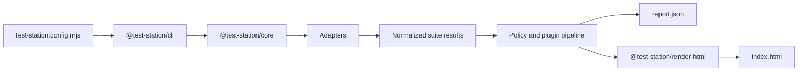

# test-station

[](https://www.npmjs.com/package/@test-station/cli)
[](https://test-station.smysnk.com/)
[](https://test-station.smysnk.com/)
[](https://test-station.smysnk.com/)

Demo: [Latest self-test report](https://smysnk.github.io/test-station/) | [Latest `report.json`](https://smysnk.github.io/test-station/report.json)

`test-station` is a framework- and language-agnostic test orchestration and reporting toolkit.

It runs suites from multiple test systems, normalizes the results into a single `report.json`, and renders a drillable HTML report with module, theme, package, suite, test, and coverage views.

Built-in adapters currently target common JavaScript tooling, but the execution contract is not tied to a specific language or framework. If a project can produce structured test results or can be wrapped by an adapter, it can be reported through `test-station`.

## Purpose

Use `test-station` when raw test output is too fragmented to be operationally useful.

Typical cases:

- monorepos with multiple packages and mixed frameworks
- projects that combine unit, browser, e2e, and shell-driven validation
- teams that need one report surface for pass/fail, duration, ownership, and coverage
- projects that want policy-aware grouping such as modules, themes, or product areas

## What It Produces

A run produces:

- `report.json`: normalized machine-readable results
- `modules.json`: module/theme rollups for machine consumers
- `ownership.json`: module/theme ownership rollups
- `index.html`: interactive HTML report
- `raw/`: per-suite raw artifacts and framework output

The HTML report supports:

- module-first and package-first views
- progressive drilldown from summary to individual test detail
- pass/fail, duration, and test-count rollups
- coverage rollups and per-file coverage tables
- optional ownership, classification, and source-analysis enrichment

### Report Overview


### Drilldown View


## Architecture

The system is split into small packages with explicit boundaries.

1. `@test-station/cli`
   Main install package. Runs configured suites and writes JSON + HTML artifacts.
2. `@test-station/core`
   Loads config, resolves adapters, executes suites, normalizes results, applies policy, and builds the report model.
3. `@test-station/render-html`
   Renders the normalized report into the interactive HTML UI.
4. Built-in adapters
   - `@test-station/adapter-node-test`
   - `@test-station/adapter-vitest`
   - `@test-station/adapter-playwright`
   - `@test-station/adapter-shell`
   - `@test-station/adapter-jest`
5. Built-in enrichment/plugin package
   - `@test-station/plugin-source-analysis`

### Execution Flow



### Package Responsibilities

- `@test-station/cli`: command entrypoint and artifact writing
- `@test-station/core`: config loading, orchestration, normalization, aggregation, coverage rollups, policy pipeline
- `@test-station/render-html`: browser report UI and report rendering
- `@test-station/adapter-node-test`: direct `node --test` execution and normalization
- `@test-station/adapter-vitest`: Vitest execution, normalization, and coverage collection
- `@test-station/adapter-playwright`: Playwright execution and normalization
- `@test-station/adapter-shell`: arbitrary command-backed suites
- `@test-station/adapter-jest`: Jest execution, normalization, and coverage collection
- `@test-station/plugin-source-analysis`: static enrichment of assertions, setup, mocks, and source snippets

## Quickstart

### Local Checkout

This is the fastest way to see the reporter running against its own test suite.

```sh
git clone https://github.com/smysnk/test-station.git
cd test-station
yarn install
yarn test:coverage
```

Artifacts are written to:

```text
.test-results/self-test-report/
```

### npm Install

For most consumers, install `@test-station/cli`. It provides the `test-station` binary and brings in `@test-station/core`, `@test-station/render-html`, and the built-in adapters used by the default runtime.

```sh
npm install --save-dev @test-station/cli
```

Install additional packages only when you need them directly:

- `@test-station/core` for `defineConfig(...)`, `runReport(...)`, or other programmatic control
- `@test-station/render-html` when rendering HTML from an existing `report.json`
- `@test-station/plugin-source-analysis` when importing the enrichment plugin directly
- `@test-station/adapter-*` when assembling a custom adapter registry outside the default core bundle

### Minimal Consumer Setup

Create `test-station.config.mjs` in the target project:

```js
const rootDir = import.meta.dirname;

export default {
  schemaVersion: '1',
  project: {
    name: 'my-project',
    rootDir,
    outputDir: 'artifacts/test-report',
    rawDir: 'artifacts/test-report/raw',
  },
  execution: {
    continueOnError: true,
    defaultCoverage: false,
  },
  suites: [
    {
      id: 'unit',
      label: 'Unit Tests',
      adapter: 'node-test',
      package: 'app',
      cwd: rootDir,
      command: ['node', '--test', './test/**/*.test.js'],
      coverage: {
        enabled: true,
        mode: 'same-run',
      },
    },
  ],
};
```

With `@test-station/cli` installed, run it with:

```sh
npx test-station run --config ./test-station.config.mjs
npx test-station run --config ./test-station.config.mjs --coverage
npx test-station run --config ./test-station.config.mjs --no-coverage
```

### Package Script Integration

#### Yarn

```json
{
  "scripts": {
    "test": "test-station run --config ./test-station.config.mjs",
    "test:coverage": "test-station run --config ./test-station.config.mjs --coverage",
    "test:fast": "test-station run --config ./test-station.config.mjs --no-coverage"
  }
}
```

#### npm

```json
{
  "scripts": {
    "test": "test-station run --config ./test-station.config.mjs",
    "test:coverage": "test-station run --config ./test-station.config.mjs --coverage",
    "test:fast": "test-station run --config ./test-station.config.mjs --no-coverage"
  }
}
```

#### pnpm

```json
{
  "scripts": {
    "test": "test-station run --config ./test-station.config.mjs",
    "test:coverage": "test-station run --config ./test-station.config.mjs --coverage",
    "test:fast": "test-station run --config ./test-station.config.mjs --no-coverage"
  }
}
```

### CLI Commands And Overrides

The public CLI surface is:

```sh
npx test-station inspect --config ./test-station.config.mjs
npx test-station run --config ./test-station.config.mjs --coverage --workspace app --output-dir ./artifacts/app-report
npx test-station render --input ./artifacts/test-report/report.json --output ./artifacts/test-report
npx test-station pages --input ./artifacts/test-report/report.json --output ./artifacts/test-pages
```

Useful overrides:

- `--coverage` and `--no-coverage` override `execution.defaultCoverage`
- `--workspace <name>` and `--package <name>` are equivalent repeatable filters
- `--output-dir <path>` overrides `project.outputDir` and rewrites `raw/` under that directory

When filters match no suites, the run exits with a clear error. If `workspaceDiscovery.packages` still lists other workspaces, those unmatched packages remain visible as `skipped`.

## Integration Model

A host project typically owns only three things:

- `test-station.config.mjs`
- a classification / coverage attribution / ownership manifest
- optional host-specific plugins or custom adapters when generic ones are not enough

Everything else should be delegated to `test-station`.

### Uniform Runtime Contract

All built-in command-backed adapters follow the same integration rules:

- declare suites explicitly in `test-station.config.mjs`
- pass per-suite environment variables with `suite.env`
- consume normalized output from `report.json`
- use `raw/` for framework-native artifacts and intermediate reports

### Empty Workspaces And Zero-Test Suites

If `workspaceDiscovery.packages` lists a package with no matching suites, that package still appears in the report as `skipped` with zero suites. This is the recommended way to keep explicit monorepo packages visible without inventing synthetic suite results.

If a suite runs and the underlying framework reports zero tests, the suite is normalized as `skipped`.

### Adapter Notes

- `node-test` coverage works for direct `node --test ...` commands and package scripts that resolve directly to a single `node --test ...` invocation
- `playwright` can collect browser Istanbul coverage when `suite.coverage.strategy` is `browser-istanbul`
- `shell` supports `resultFormat: 'single-check-json-v1'` for structured single-check outputs with mapped warnings and raw details
- `shell` supports `resultFormat: 'suite-json-v1'` for full structured suite payloads, including custom `performanceStats` for benchmark reporting

### Playwright In CI

Consumers using the built-in Playwright adapter must install Playwright browsers in CI before running the reporter.

Typical prerequisite:

```sh
yarn playwright install --with-deps
```

### Live UI Performance Benchmarks

This repo also carries a manual Playwright benchmark suite for the deployed web interface. It is intended for live-data navigation checks and is not part of the default CI pass.

Typical usage:

```sh
yarn playwright install --with-deps chromium
TEST_STATION_E2E_BASE_URL=https://test-station.smysnk.com yarn test:e2e:performance
```

What it benchmarks:

- public home-page readiness with live project and run data
- sidebar project focus latency
- run-row navigation into `/runs/[id]`
- runner-report iframe readiness
- switching from runner report to operations view
- navigation from a run into the related project page

Artifacts:

- summary JSON at `artifacts/e2e-performance/latest.json`
- timestamped benchmark snapshots under `artifacts/e2e-performance/`
- Playwright JSON output at `artifacts/e2e-performance/playwright-results.json`

Each benchmark record now also carries a `profiling` block with:

- server-side page-load timings captured during `getServerSideProps`
- browser page-ready marks for overview, project, run, operations, and runner-frame milestones
- recent client-side route-transition events
- recent browser-side traced fetches and their upstream response ids
- resource timings for `/graphql`, `/_next/data/`, and runner-report iframe requests

These profiling fields only appear once the target deployment is running a build that includes the instrumentation hooks from this repo.

The traced web responses also expose:

- `x-request-id`
- `x-test-station-trace-id`
- `x-test-station-parent-request-id` when a request is part of a larger chain
- `x-test-station-upstream-request-id` / `x-test-station-upstream-trace-id` on proxied web API responses
- `Server-Timing` for SSR page loads and GraphQL endpoint timing

Optional environment variables:

- `TEST_STATION_E2E_BASE_URL`: target deployment to benchmark
- `TEST_STATION_E2E_STORAGE_STATE`: optional Playwright storage-state file when the target requires authentication
- `TEST_STATION_E2E_OUTPUT_DIR`: override the benchmark artifact directory
- `TEST_STATION_E2E_BUDGET_HOME_READY_MS`
- `TEST_STATION_E2E_BUDGET_PROJECT_FOCUS_MS`
- `TEST_STATION_E2E_BUDGET_PROJECT_CLEAR_MS`
- `TEST_STATION_E2E_BUDGET_RUN_NAVIGATION_MS`
- `TEST_STATION_E2E_BUDGET_RUNNER_REPORT_READY_MS`
- `TEST_STATION_E2E_BUDGET_OPERATIONS_VIEW_SWITCH_MS`
- `TEST_STATION_E2E_BUDGET_PROJECT_PAGE_NAVIGATION_MS`

### Live UI Interaction Regressions

This repo also carries a separate live-data interaction suite for the visible navigation surfaces. Unlike the benchmark suite, these tests do not fall back to direct route changes, so they fail when a click target stops navigating.

Typical usage:

```sh
yarn playwright install --with-deps chromium
TEST_STATION_E2E_BASE_URL=https://test-station.smysnk.com yarn test:e2e:interactions
```

What it checks:

- clicking a home-page run row opens the run detail page
- clicking a project execution-feed run link opens the run detail page
- clicking `Operations view` switches from the runner report to the operations template
- clicking the project link on a run detail page navigates back to the related project page

Artifacts:

- Playwright JSON output at `artifacts/e2e-interactions/playwright-results.json`
- traces and screenshots under `artifacts/e2e-interactions/test-results/`

Optional environment variables:

- `TEST_STATION_E2E_BASE_URL`: target deployment to exercise
- `TEST_STATION_E2E_STORAGE_STATE`: optional Playwright storage-state file when the target requires authentication
- `TEST_STATION_E2E_INTERACTIONS_OUTPUT_DIR`: override the interaction artifact directory

If the app redirects to `/auth/signin` and no storage state is provided, or if there are no public runs/projects visible, the benchmark suite skips rather than failing with misleading timing output.

### Publishing CI Runs To `/api/ingest`

The deployed server accepts machine reports at `POST /api/ingest` with shared-key auth. The checked-in staging release workflow publishes the self-test report to `https://test-station.smysnk.com/api/ingest`.

What is sent:

- `report.json` as the canonical run payload
- run metadata from GitHub Actions such as repository, branch, tag, commit SHA, actor, run URL, workflow, run number, attempt, build start/end timestamps, and the default non-secret GitHub Actions environment variables
- artifact metadata for every file under the report output directory, including `report.json`, `modules.json`, `ownership.json`, `index.html`, and everything under `raw/`

Shared-key auth:

- the server reads `INGEST_SHARED_KEY`
- the staging release workflow reads the GitHub Actions secret `TEST_STATION_INGEST_SHARED_KEY`
- set them to the same value

Optional S3-backed artifact storage:

- set `vars.S3_BUCKET` to enable `aws s3 sync` of the report directory
- optionally set `vars.S3_STORAGE_PREFIX` to control the object prefix
- optionally set `vars.S3_PUBLIC_URL` when the uploaded artifacts are browser-accessible through S3 static hosting, CloudFront, or another CDN
- set `secrets.S3_AWS_ACCESS_KEY_ID` and `secrets.S3_AWS_SECRET_ACCESS_KEY` for the sync credentials
- optionally set `vars.S3_AWS_REGION` to override the default `us-east-1`

Current storage model:

- the ingest endpoint stores artifact metadata, storage keys, and source URLs in Postgres
- it does not upload binary artifacts itself
- without S3 or another external artifact host, the server still records artifact inventory but not downloadable remote URLs

### Raw Artifact Contract

Suites can attach raw artifacts that will be written under `raw/` and linked from the HTML report.

Supported shapes:

```js
rawArtifacts: [
  {
    relativePath: 'web-e2e/playwright.json',
    label: 'Playwright JSON',
    content: JSON.stringify(payload, null, 2),
  },
  {
    relativePath: 'web-e2e/trace.zip',
    label: 'Trace ZIP',
    sourcePath: '/absolute/path/to/trace.zip',
    mediaType: 'application/zip',
  },
  {
    relativePath: 'web-e2e/test-results',
    label: 'Copied test-results directory',
    kind: 'directory',
    sourcePath: '/absolute/path/to/test-results',
  },
]
```

Use this contract for stable raw links. Do not treat it as a generic process-management or upload system.

### Consumer Modes

There are two supported consumer modes:

1. Local reference checkout
   - useful while the standalone repo is being developed alongside a host project
   - stable host-facing entrypoints are:
     - `./references/test-station/config.mjs`
     - `./references/test-station/bin/test-station.mjs`
2. Installed package dependency
   - install `@test-station/cli` for the published `test-station` binary
   - install `@test-station/core` if you want `defineConfig(...)` or `runReport(...)`
   - install `@test-station/render-html` only when rendering from an existing `report.json` outside the CLI
   - install direct adapter or plugin packages only for custom registries and advanced embedding

For local-reference mode, keep host imports pointed at the root-level entrypoints above rather than `packages/*/src`.

### Classification, Coverage Attribution, Ownership, And Thresholds

If you want the report grouped by product or subsystem instead of leaving tests uncategorized, provide a manifest file.

```json
{
  "rules": [
    {
      "package": "app",
      "include": ["test/**/*.test.js"],
      "module": "runtime",
      "theme": "api"
    }
  ],
  "coverageRules": [
    {
      "package": "app",
      "include": ["src/**/*.js"],
      "module": "runtime",
      "theme": "api"
    }
  ],
  "ownership": {
    "modules": [
      { "module": "runtime", "owner": "runtime-team" }
    ],
    "themes": [
      { "module": "runtime", "theme": "api", "owner": "runtime-api-team" }
    ]
  },
  "thresholds": {
    "modules": [
      {
        "module": "runtime",
        "coverage": { "linesPct": 80, "branchesPct": 70 },
        "enforcement": "error"
      }
    ],
    "themes": [
      {
        "module": "runtime",
        "theme": "api",
        "coverage": { "linesPct": 75 },
        "enforcement": "warn"
      }
    ]
  }
}
```

Reference it from config:

```js
manifests: {
  classification: './test-modules.json',
  coverageAttribution: './test-modules.json',
  ownership: './test-modules.json',
  thresholds: './test-modules.json',
}
```

Error-enforced threshold failures are reported in `report.json`, rendered in HTML, and cause `test-station run` to exit non-zero even when every suite itself passed. Warning-enforced thresholds stay visible in the report but do not fail the process.

### Failure Diagnostics

Suites can define an optional diagnostics rerun. When the suite fails, `test-station` reruns the configured command, captures stdout/stderr, and writes the diagnostic artifacts under `raw/diagnostics/`.

```js
{
  id: 'web-unit',
  adapter: 'vitest',
  command: ['yarn', 'vitest', 'run', '--config', './vitest.config.js'],
  diagnostics: {
    label: 'Verbose rerun',
    command: ['yarn', 'vitest', 'run', '--config', './vitest.config.js', '--reporter', 'verbose'],
    timeoutMs: 120000,
  },
}
```

The rerun metadata is attached to the suite result as `suite.diagnostics`, linked from the HTML report, and summarized in the console output.

### Custom Policy Plugins

A plugin can hook into these stages:

- `classifyTest(...)`
- `attributeCoverageFile(...)`
- `lookupOwner(...)`
- `enrichTest(...)`

Register plugins like this:

```js
plugins: [
  {
    handler: './scripts/test-station/my-policy-plugin.mjs',
    options: {
      owner: 'platform-team',
    },
  },
]
```

## Examples

- Generic consumer example:
  [`examples/generic-node-library/test-station.config.mjs`](https://github.com/smysnk/test-station/blob/main/examples/generic-node-library/test-station.config.mjs)
- Mixed-framework example:
  [`examples/mixed-framework-monorepo/test-station.config.mjs`](https://github.com/smysnk/test-station/blob/main/examples/mixed-framework-monorepo/test-station.config.mjs)
- Integration guide:
  [`docs/integrating-a-generic-project.md`](https://github.com/smysnk/test-station/blob/main/docs/integrating-a-generic-project.md)

## Development

Run the standalone repo checks with:

```sh
yarn lint
yarn test:node
yarn test
yarn build
```

`yarn test:node` runs the direct Node test suite. `yarn test` runs the repository through `test-station` itself and produces the self-test report.

The current external-consumer smoke path is:

```sh
node ./bin/test-station.mjs run --config ./examples/generic-node-library/test-station.config.mjs --coverage
```

## Versioning

All publishable `@test-station/*` packages currently move in lockstep at `0.2.0`.

For deeper release and compatibility details, see:

- [`docs/integrating-a-generic-project.md`](https://github.com/smysnk/test-station/blob/main/docs/integrating-a-generic-project.md)
- [`docs/versioning-and-release-strategy.md`](https://github.com/smysnk/test-station/blob/main/docs/versioning-and-release-strategy.md)
